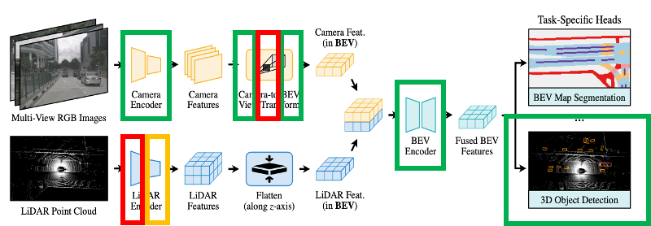

# BEVFusion_TVM

## Project info



> 🔥 BEVFusion의 모델을 8개의 모듈로 분리하여 각각 최적화
>
> -   **초록색 박스는 컴파일러 최적화(TVM, TensorRT 등) 적용**
> -   빨간색 박스는 CUDA code, 혹은 다른 병렬 라이브러리(ex. OpenCL) 적용
> -   노란색 박스는 custom operation 정의하여 최적화

> ✅ inference.ipynb에 파이프라인을 구현하였고, 이를 자유자재로 수정 가능
>
> -   models.py에서 model define, inference.ipynb에서는 only call/inference
> -   model을 제외한, dataloader / evaluation은 MMDetection3D의 것을 그대로 사용

## Getting started

```
# using CUDA 12.1, TensorRT 10.9.0.34
conda create -n bevfusion -c conda-forge "llvmdev>=15" "cmake>=3.24" git python=3.11
conda activate bevfusion

pip install torch==2.1.0 torchvision==0.16.0 torchaudio==2.1.0 --index-url https://download.pytorch.org/whl/cu121
pip install mmcv==2.1.0 -f https://download.openmmlab.com/mmcv/dist/cu121/torch2.1/index.html
pip install -U openmim
pip install "numpy<2"
mim install mmengine

git clone https://github.com/open-mmlab/mmdetection3d.git
cd mmdetection3d
git checkout v1.4.0
pip install -r requirements/build.txt
pip install -e .
python projects/BEVFusion/setup.py develop
cd ..

git clone https://github.com/open-mmlab/mmdetection.git
cd mmdetection
git checkout v3.3.0
pip install -r requirements/build.txt
pip install -e .
cd ..

pip install onnx
pip install onnxruntime-gpu
pip install spconv-cu120

# transfusion_head.py 320, 334, 336, 339, 760번째 줄 아래처럼 바꾸기
# 320: return [new_res], self.query_labels.float()
# 334: res, query_labels = multi_apply(self.forward_single, feats, [metas])
# 336: return res, query_labels
# 339: preds_dicts, _ = self(batch_feats, batch_input_metas)
# 760: preds_dicts, _ = self(batch_feats, batch_input_metas)

# transfusion_head.py 239번째 줄 아래처럼 바꾸기
# local_max[:, 8, ] = heatmap[:, 8]
# local_max[:, 9, ] = heatmap[:, 9]

# transfusion_head.py 253번째 줄 아래처럼 바꾸기
# top_proposals = heatmap.view(batch_size, -1).topk(k=self.num_proposals, dim=-1, largest=True)[1]

# config 파일에서 data_root를 절대 경로로 바꾸기
# ex) data_root = '/home/noheat/OD/nuscenes/'

# Faster Voxelization -> ops/voxel/src/voxelization.h 74번째 줄 아래처럼 바꾸기
# return hard_voxelize_gpu2(points, voxels, coors, num_points_per_voxel,

python export-onnx.py
python export-onnx-scn.py
python onnx-sim.py
python setup.py develop
./onnx2trt.sh --fp16

git clone --recursive https://github.com/apache/tvm tvm
cd tvm
rm -rf build && mkdir build && cd build
cp ../cmake/config.cmake .

echo "set(CMAKE_BUILD_TYPE RelWithDebInfo)" >> config.cmake
echo "set(USE_LLVM \"llvm-config --ignore-libllvm --link-static\")" >> config.cmake
echo "set(HIDE_PRIVATE_SYMBOLS ON)" >> config.cmake
echo "set(USE_CUDA   ON)" >> config.cmake
echo "set(USE_CUDNN  ON)" >> config.cmake

cmake .. && cmake --build . --parallel $(nproc)
cd ../python
python setup.py install --user
```
